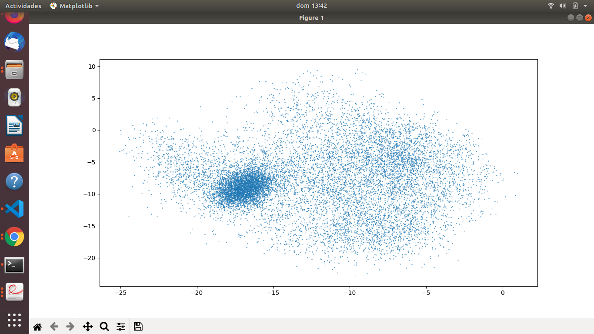

PAV - P4: reconocimiento y verificación del locutor
===================================================

Obtenga su copia del repositorio de la práctica accediendo a [Práctica 4](https://github.com/albino-pav/P4)
y pulsando sobre el botón `Fork` situado en la esquina superior derecha. A continuación, siga las
instrucciones de la [Práctica 3](https://github.com/albino-pav/P3) para crear una rama con el apellido de
los integrantes del grupo de prácticas, dar de alta al resto de integrantes como colaboradores del proyecto
y crear la copias locales del repositorio.

También debe descomprimir, en el directorio `PAV/P4`, el fichero [db_spk.tgz](https://atenea.upc.edu/pluginfile.php/3008277/mod_assign/introattachment/0/db_spk.tgz?forcedownload=1)
con la base de datos oral que se utilizará en la parte experimental de la práctica.

Como entrega deberá realizar un *pull request* con el contenido de su copia del repositorio. Recuerde
que los ficheros entregados deberán estar en condiciones de ser ejecutados con sólo ejecutar:

~~~~~~~~~~~~~~~~~~~~~~~~~~~~~~~~~~~~~~~~~~~~~~~~~~~~~.sh
  make release
  run_spkid mfcc train test classerr verify verifyerr
~~~~~~~~~~~~~~~~~~~~~~~~~~~~~~~~~~~~~~~~~~~~~~~~~~~~~

A modo de memoria de la práctica, complete, en este mismo documento y usando el formato *markdown*, los
ejercicios indicados.

## Ejercicios.

### Extracción de características.

- Escriba el *pipeline* principal usado para calcular los coeficientes cepstrales de predicción lineal
  (LPCC), en su fichero <code>scripts/wav2lpcc.sh</code>:
~~~~~~~~~~~~~~~~~~~~~~~~~~~~~~~~~~~~~~~~~~~~~~~~~~~~~~~~~~~~~~~~~~~~~~~~~~~~~~~~~~~~~~~~~~~~~~~~~.sh
sox $inputfile -t raw - dither -p12 | $X2X +sf | $FRAME -l 200 -p 40 | $WINDOW -l 200 | $LPC -l 200 -m $lpc_order | $LPC2C -m $lpc_order -M $nceps > $base.cep
~~~~~~~~~~~~~~~~~~~~~~~~~~~~~~~~~~~~~~~~~~~~~~~~~~~~~~~~~~~~~~~~~~~~~~~~~~~~~~~~~~~~~~~~~~~~~~~~~
~~~~~~~~~~~~~~~~~~~~~~~~~~~~~~~~~~~~~~~~~~~~~~~~~~~~~~~~~~~~~~~~~~~~~~~~~~~~~~~~~~~~~~~~~~~~~~~~~.sh
# A modo de ejemplo de cómo incorporar código fuente a un fichero markdown, el pipeline siguiente
# es el usado para calcular los coeficientes de predicción lineal (LP) en el script wav2lp.sh:
sox $inputfile -t raw - | $X2X +sf | $FRAME -l 400 -p 80 | $WINDOW -l 400 -L 400 |
        $LPC -l 400 -m $lpc_order > $base.lp
~~~~~~~~~~~~~~~~~~~~~~~~~~~~~~~~~~~~~~~~~~~~~~~~~~~~~~~~~~~~~~~~~~~~~~~~~~~~~~~~~~~~~~~~~~~~~~~~~

- Escriba el *pipeline* principal usado para calcular los coeficientes cepstrales en escala Mel (MFCC), en
  su fichero <code>scripts/wav2mfcc.sh</code>:
~~~~~~~~~~~~~~~~~~~~~~~~~~~~~~~~~~~~~~~~~~~~~~~~~~~~~~~~~~~~~~~~~~~~~~~~~~~~~~~~~~~~~~~~~~~~~~~~~.sh
sox $inputfile -t raw - dither -p12 | $X2X +sf | $FRAME -l 200 -p 40 | $MFCC -l 200 -m $mfcc_order -s 8 -n $ncoef > $base.mfcc
~~~~~~~~~~~~~~~~~~~~~~~~~~~~~~~~~~~~~~~~~~~~~~~~~~~~~~~~~~~~~~~~~~~~~~~~~~~~~~~~~~~~~~~~~~~~~~~~~
- Indique qué parámetros considera adecuados para el cálculo de los coeficientes LPCC y MFCC.
~~~~~~~~~~~~~~~~~~~~~~~~~~~~~~~~~~~~~~~~~~~~~~~~~~~~~~~~~~~~~~~~~~~~~~~~~~~~~~~~~~~~~~~~~~~~~~~~~.sh
EXEC="wav2lpcc 19 26 $db/$filename.wav $w/$FEAT/$filename.$FEAT"
~~~~~~~~~~~~~~~~~~~~~~~~~~~~~~~~~~~~~~~~~~~~~~~~~~~~~~~~~~~~~~~~~~~~~~~~~~~~~~~~~~~~~~~~~~~~~~~~~
   
   
   
Hemos decidido por prueva i error consiguiendo un aceptable error_rate un orden de lpc de 19 i el número de
    cepstrums = 26.
    Por otro lado, para el cálculo de los coeficientes
 MFCC:
    
    
~~~~~~~~~~~~~~~~~~~~~~~~~~~~~~~~~~~~~~~~~~~~~~~~~~~~~~~~~~~~~~~~~~~~~~~~~~~~~~~~~~~~~~~~~~~~~~~~~.sh
EXEC="wav2mfcc 14 19 $db/$filename.wav $w/$FEAT/$filename.$FEAT"
~~~~~~~~~~~~~~~~~~~~~~~~~~~~~~~~~~~~~~~~~~~~~~~~~~~~~~~~~~~~~~~~~~~~~~~~~~~~~~~~~~~~~~~~~~~~~~~~~
   
 -En este caso usamos un orden de mfcc de 14 por ser de forma generalizada óptimo y 19 coefs. También por 
    prueba y error, obtenemos un error_rate de 0.89%. Bastante mejor resultado que el obtenido anteriormente.
  

- Inserte una imagen mostrando la dependencia entre los coeficientes 2 y 3 de las tres parametrizaciones
  para una señal de prueba.
  
  *La imagen siguiente es un ejemplo de cómo insertar imágenes en markdown*
  <h5>LPC</h5>
  
  <h5>LPCC</h5>
  
  <h5>MFCC</h5>
  
  
  + ¿Cuál de ellas le parece que contiene más información?
  
 De entre las 3 opciones, observamos que los coeficientes mel-cepstrum és la representación que muestra más información.
  Esto es así porqué el cepstrum concentra la información del trozo de señal analizado en un numero reducido de muestras y   
  tiene coeficientes más incorrelados que en los demas casos. Esto hará que en el momento de clasificación habrá menos 
  redundancia. 
  También cal mencionar que al calcular los coeficientes Mel, se da importancia a unas determinadas frecuencias que tienen 
  más importancia a nivel de percepción del sistema auditivo humano.

    
  
- Usando el programa <code>pearson</code>, obtenga los coeficientes de correlación normalizada entre los
  parámetros 2 y 3, y rellene la tabla siguiente con los valores obtenidos.

  |                        | LP   | LPCC | MFCC |
  |------------------------|:----:|:----:|:----:|
  | &rho;x[2,3] |      |      |      |
  
  + Compare los resultados de <code>pearson</code> con los obtenidos gráficamente.
  
### Entrenamiento y visualización de los GMM.

- Inserte una gráfica que muestre la función de densidad de probabilidad modelada por el GMM de un locutor
  para sus dos primeros coeficientes de MFCC.
  
  
  
- Inserte una gráfica que permita comparar los modelos y poblaciones de dos locutores distintos. Comente el
  resultado obtenido y discuta si el modelado mediante GMM permite diferenciar las señales de uno y otro.
  
  
  
     

        Para implementar el sistema que se adapte mejor a las señales, hemos calculado los MFCC de forma que se reduce considerablemente el conjunto de datos de salida. Esta salida se representa a partir de sus direcciones de máxima varianza  Cuando hemos obtenido todas las características, se procede a hacer la parametrización que se hace a partir de un conjunto de gaussianas. A partir de la relación entre la parametrización y los datos podemos diferenciar las señales de cada uno de los locutores. En función de la probabilidad por la que decidir, el modelo más parecido.
     

### Reconocimiento del locutor.

- Inserte una tabla con la tasa de error obtenida en el reconocimiento de los locutores de la base de datos
  SPEECON usando su mejor sistema de reconocimiento para los parámetros LP, LPCC y MFCC.
  
   |                 | LP   | LPCC | MFCC |
  |------------------|:----:|:----:|:----:|
  | ERROR_RATE      |2.68%|0.64%|0.89%|

### Verificación del locutor.

- Inserte una tabla con el *score* obtenido con su mejor sistema de verificación del locutor en la tarea
  de verificación de SPEECON. La tabla debe incluir el umbral óptimo, el número de falsas alarmas y de
  pérdidas, y el score obtenido usando la parametrización que mejor resultado le hubiera dado en la tarea
  de reconocimiento.
  
   |                 | LP   | LPCC | MFCC |
   |------------------|:----:|:----:|:----:|
   | COSTDETECT       |60.4% |11.2  | 24.0% |
    | MISSED       |151/250 | 28/250 | 60/250 |

	

		Falsa alarma 0 en todos los casos
	

### Test final y trabajo de ampliación.

- Recuerde adjuntar los ficheros `class_test.log` y `verif_test.log` correspondientes a la evaluación
  *ciega* final.

- Recuerde, también, enviar a Atenea un fichero en formato zip o tgz con la memoria con el trabajo
  realizado como ampliación, así como los ficheros `class_ampl.log` y/o `verif_ampl.log`, obtenidos como
  resultado del mismo.

